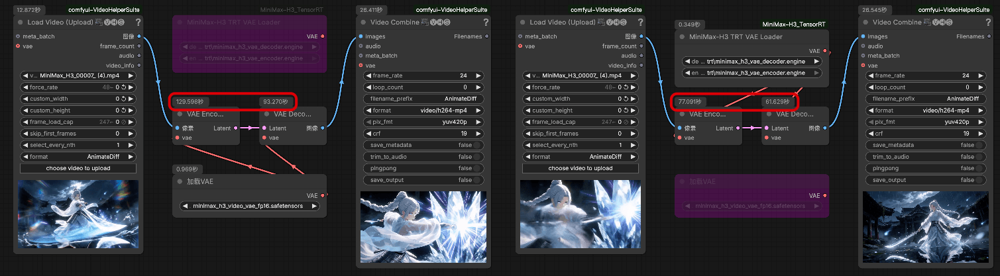
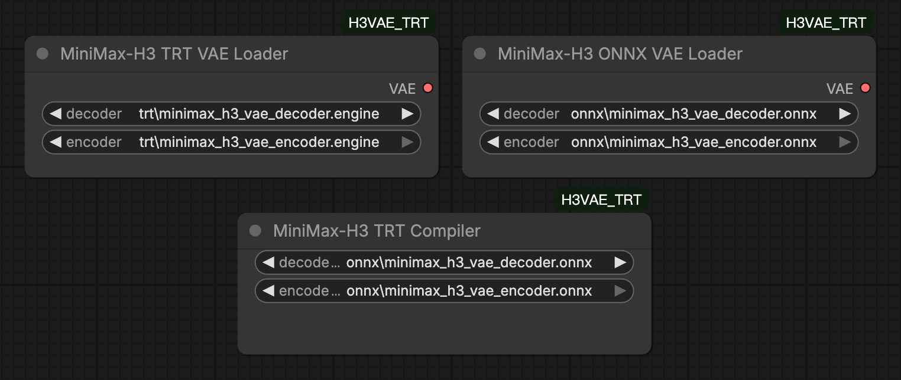

# ComfyUI-H3VAE_TRT

在 ComfyUI 中运行 MiniMax-H3 VAE 的 ONNX/TRT 版本，最高可提升约 1.7 倍的编解码速度

## 预览




## 安装

#### 安装节点：
```bash
cd ComfyUI/custom_nodes
git clone https://github.com/lihaoyun6/ComfyUI-H3VAE_TRT.git
python -m pip install -r ComfyUI-H3VAE_TRT/requirements.txt
```

## 用法

### 下载模型

1. 下载全部 3 个模型 -> [点击这里](https://huggingface.co/lihaoyun6/MiniMax-H3-VAE-ONNX)
2. 将它们放入 `ComfyUI/models/vae` 目录

### 节点

- 你可以直接运行 ONNX 模型，但通常速度较慢。推荐使用 `MiniMax-H3 TRT Compiler` 节点将 ONNX 模型编译为 TRT 引擎。
- 成功编译 TRT Engine 后，就可以使用 `MiniMax-H3 TRT VAE Loader` 节点加载它们了。

## 致谢

- [ComfyUI](https://github.com/comfyanonymous/ComfyUI) @comfyanonymous
- [MiniMax-H3](https://github.com/MiniMax-AI/MiniMax-H3) @MiniMax-AI
